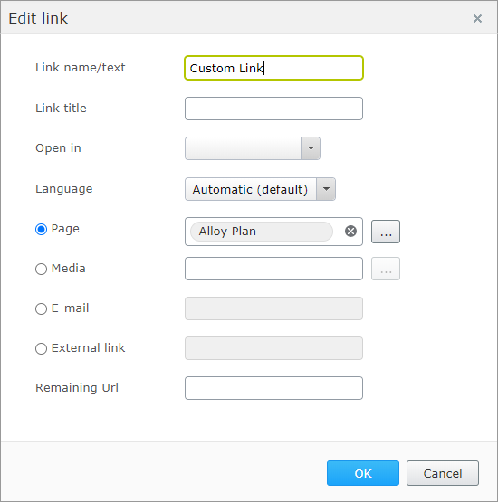
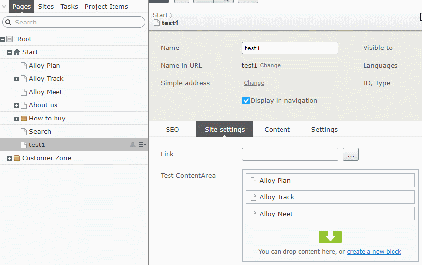

# Episerver Labs - LinkItem Property

LinkProperty lab addon allows Editors to manage single LinkItem instance.

The property is just a new UI Editor and it still use
`PropertyLinkCollection` as a backing type.
It's a LinkItemCollection property with just one item.

The new editor looks similar to ContentReference editor:


When editing a link, then same dialog as for LinkItemCollection property is displayed:



## Using LinkItem property

To use `LinkItemCollection` as model type, you just need to annotate 
LinkItemCollection property with `LinkItemProperty` attribute:
````
[ContentType(GUID = "19671657-B684-4D95-A61F-8DD4FE60D559"]
public class StartPage : PageData
{
    [LinkItemProperty]
    public virtual LinkItemCollection IntranetLink { get; set; }
}
````

To use `LinkItem` as a model type, additionally you have to add
`BackingTypeAttribute` attribute and override default getter and setter.
There are extension methods, so it's just two lines of code:
````
[ContentType(GUID = "19671657-B684-4D95-A61F-8DD4FE60D559"]
public class StartPage : PageData
{
    [LinkItemProperty]
    [BackingType(typeof(PropertyLinkCollection))]
    public virtual LinkItem Link
    {
        get => this.GetLinkItemPropertyValue(nameof(Link));
        set => this.SetLinkItemPropertyValue(nameof(Link), value);
    }
}
````

For `LinkItem` as a model, you can additionally use custom property renderer.
It requires adding `EPiServer.Labs.LinkItemProperty.LinkItemRendering.Tag`
tag when rendering:
````
@using AlloyTemplates
@model PageViewModel<TestPage>

@Html.PropertyFor(x => x.CurrentPage.Link, new { Tag = EPiServer.Labs.LinkItemProperty.LinkItemRendering.Tag })
````


To add new link, you can use edit button, D&D content from page tree
or D&D from other reference properties on the page:




## Telemetry opt-in

> NOTE: Telemetry is automatically enabled in DXC environment and can not be opted-out.

In non-DXC environments telemetry is not enabled by default. To opt-in to telemetry, add the following code to your initialization module.

```csharp
public void ConfigureContainer(ServiceConfigurationContext context)
{
    context.Services.Configure<TelemetryOptions>(options => options.OptedIn = true);
}
```

## Install

```Install-Package EPiServer.Labs.LinkItemProperty```

https://nuget.episerver.com/package/?id=EPiServer.Labs.LinkItemProperty

## Development (if you would like to help in development)

```console
>> build\tools\nuget.exe restore
>> setup.cmd
>> site.cmd
```

## Telemetry information

In a quest to understand our users more and effectivize our resources so that we can deliver the best user experience possible, we've decided to gather some useful telemetry so that we can make more informed decisions on what we should improve, support
and maybe not pursue when developing new features for CMS UI. We assure that the data we collect is completely anonymized and will only be used internally for making decisions on improving the user experience.

If you allow us to learn more about what we should be building, please make sure these two URL's are not blocked:

* Live Configuration: `https://cmsui.episerver.net/api/telemetryconfig`
* Tracking: `https://dc.services.visualstudio.com/v2/track` (this can change on Microsoft's discretion)

### Taxonomy of custom events

#### Always included

Every tracking event includes [standard Application Insights dimensions](https://docs.microsoft.com/en-us/azure/azure-monitor/app/api-custom-events-metrics#trackevent). The [authenticated user and client ID](https://docs.microsoft.com/en-us/azure/azure-monitor/app/api-custom-events-metrics#authenticated-users) are set as:

* `ai.user.authUserId`: String, a SHA512 hash without salt, using user email if available and username otherwise. To anonymize user but allow tracking between products.
* `ai.user.accountId`: String, a SHA512 hash without salt, using the License key. To allow for grouping of users.


### Please note
> Episerver Labs projects are meant to provide the developer community with pre-release features with the purpose of showcasing ongoing work and getting feedback in early stages of development.
>
> You should be aware that Labs are trials and not supported Episerver releases. While we hope you use them, there are a few things you should expect from each release:
> - Functionality may be added, removed, or changed.
> - Labs projects have not been through the same quality assurance process as the versioned products and, in some cases, may show unexpected behavior.
>   - The Episerver CMS UI team notes that:
>     - the scenarios in the Readme of each CMS Lab's repo will be verified and supported us
>     - the Labs add-on may or may not work with other add-ons, we are not testing them
>     - any such issues found, such as scenarios outside of the the Readme, can be fixed by the community by submitting a Pull Request on the Github repo
> - The software may not work on all environments.
>   - The Episerver CMS UI team notes that:
>     - Although it should work on base installations of CMS UI in Chrome and Firefox
> - There is no Episerver support; however, we will gratefully receive all feedback
>   - The Episerver CMS UI team notes that:
>     - Issues created on GitHub will be triaged, and if accepted, fixed by us
>
> The software is provided “As is” without warranty of any kind or promise of support. In no event shall Episerver be liable for any claim, damages or liability in relation to the software. By using this software you are also agreeing to our developer program terms [https://www.episerver.com/legal/program-terms/](https://www.episerver.com/legal/program-terms/)
